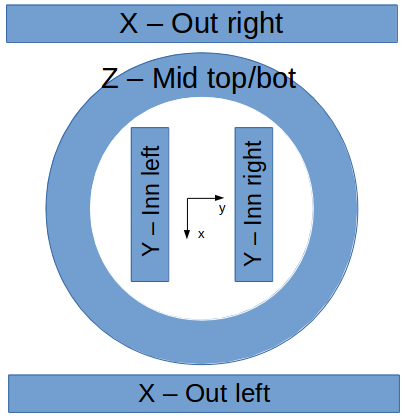

# Coil-System-Core

## Connection

|aoPin|Cable #|Coil|Comp. mT/V|
|:---:|:---:|:---:|:---:|
|2|1|Z - Mid top|5.003|
|5|2|Z - Mid bot|4.433|
|4|3|Y - Inn right|5.143|
|1|4|Y - Inn left|5.024|
|3|5|X - Out right|4.879|
|0|6|X - Out left|5.003|
|6|7|Not Used|Not Used|

## Power Supply (PSU)

|PSU #|Amplifier #|Voltage(V)|Note|
|:---:|:---:|:---:|:---:|
|1|1|24|AMC PSU (acrylic case)|
|2|2|24|AMC PSU (acrylic case)|
|3|3|24|AMC PSU (acrylic case)|
|4|4|24|small XP PSU (wooden case)|
|5|5|72|big XP PSU (wooden case)|
|5|6|72|big XP PSU (wooden case)|
|5|7|72|big XP PSU (wooden case)|
|5|8|72|big XP PSU (wooden case)|

=== ATTENTION ===

The big XP PSU uses 220V AC input. It must be plugged at the designated outlet. Make sure the fuse at the hallway is turned on. For more details, refer to the images in /Misc directory.

## Introduction

"Coil-System-Core" is a program to drive the 6-input coil system that is mainly written in C.  
With 2 more amplifiers added to the system, we are going to integrate different variations of the code and provide a stable, organized version for everyone to start with.

## How to compile

Open terminal in Linux and execute "make" in the target directory. The files included in "MakeFile" will be compiled. An executable file "tutorial" will be generated.

## Naming Convention

For the benefits of yourself and the people who will read your codes in the future, please follow the name convention defined here while programming. :P

Variables
1.	A variable name should be in mixed case starting with lower case, e.g., linearity, credibleThreat.

2.	A variable with a large scope should have meaningful names, e.g., windowWidth. A variable with a small scope can have short names, i, j, k.

3.	The prefix n should be used for variables representing the number of objects, e.g., nFiles, nSegments.

4.	Iterator variables should be named or prefixed with i, e.g., for iFile = 1 : nFiles. If it’s in a small scope, i, j, and k are fine.

Function

1.	A function name should be in all lower case connected by underscore, e.g., get_window_width(void).

2.	A function should have meaningful names.

3.	A file-wide function (only available to other functions within the same c file) should have the keyword static in its definition, e.g., static int get_window_width(void)

Thread

1.	A thread name must start with Thread, e.g., Thread_run_bangbang_controller()

2.	Follow the rules of a function name.

Boolean

1.	Use “bool” type instead of “int”. (*https://softwareengineering.stackexchange.com/questions/145323/when-should-you-use-bools-in-c)

If statement

1.	Always have a curly bracket after if statement even if it is a “one-line”.

Good: If a == 0 { x = 3 };      Bad: If a == 0 x = 3;

2.	Always put spaces between operators.

Misc

1.	Don’t have indefinite loops in your code.

2.	Don’t add irrelevant functions in the core files. Create a new file and import it.

## Roadmap

Compare the codes that are written by all members, fix the bugs, and integrate them.

Reorganize the structure of the source code and make it easier to add new functions.

Unified naming convention for files.

Update dependent packages. (OpenCV etc?)

## List of files

826api.h: Include file for applications for Sensoray's model 826 board

AccelStepper.h: Arduino AccelStepper library. It provides an object-oriented interface for 2, 3 or 4 pin stepper motors. It is modified to control the amplifier driver.

AutoFabrication.h: [Zhe] Provides basic methods for magnatic field manipulation.

callbacks.h: Trigger functions with GUI.

coilFieldControl.h: Relate magnetic fields with the signal from s826 I/O. Calibration of the magnetic field is done here.

constantValue.h: Store constant values.

FWcamera.h: [c++] A class that handles cameras.

math_subroutine.h: Mathematical functions.

s826_subroutine.h: s826 I/O control.

twistField.h: [Omid] Generates a periodically rotating field.

vision.h: Process of vision and displaying videos on the GUI.
